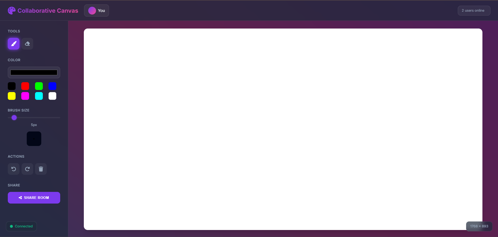

# 🎨 Real-Time Collaborative Canvas

🚀 **LIVE DEMO** 🚀  
👉 ([Click here to view live project](https://real-time-collaborative-drawing-canvas-5gl7.onrender.com))  


> 💡 **Tip:** Open the live demo in **two browser windows** to experience real-time drawing collaboration!

---

## 📸 Screenshot

A snapshot of the modern **Glassmorphism UI**, featuring the animated aurora background and drawing tools.  




---

## 🎥 Project Demo (GIF)

A short demonstration showing multiple users drawing simultaneously, along with real-time user count updates and global undo/redo functionality.  


---

## 🌟 Core Features

This is a **multi-user drawing application** built from scratch to demonstrate **real-time state synchronization** using **Vanilla JavaScript**, **Node.js**, and **WebSockets**.

### 🧠 Key Highlights:
- ⚡ **Real-Time Multi-User Collaboration**  
  All drawings, undos, redos, and clears are instantly synced across all clients.

- 👥 **Live User Count**  
  Displays the exact number of users in real-time as they join or leave.

- 🔄 **Global State Management**  
  The server maintains a single source of truth for the canvas state.

- 🧩 **Global Undo/Redo & Clear**  
  When one user undoes, redos, or clears, it updates for **everyone** instantly.

- ✏️ **Modern Drawing Tools**
  - Brush Tool  
  - Eraser Tool  
  - Full Color Picker & Quick Presets  
  - Stroke Width Slider with Live Preview  

- 💎 **Modern UI/UX**
  - Elegant **Glassmorphism** design  
  - Animated **Aurora Gradient** background  
  - Smooth hover and glow effects  

- 🔗 **Shareable Rooms**
  Instantly copy and share your room link using the “Share Room” button.

---

## 🛠️ Tech Stack

| Category | Technologies Used |
|-----------|-------------------|
| **Frontend** | HTML5 (Canvas API), CSS3 (Flexbox, Grid, Animations), Vanilla JS (ES6+) |
| **Backend** | Node.js, Express.js |
| **Real-Time Communication** | Socket.io (WebSocket-based events) |
| **Deployment** | Render (Node.js Web Service) |

---

## 📁 Project Structure

```
collaborative-canvas/
│
├── client/
│   ├── index.html         # Main UI structure
│   ├── style.css          # Glassmorphism, Aurora background, etc.
│   ├── main.js            # Entry script: handles UI and tool logic
│   ├── canvas.js          # Canvas drawing logic
│   └── websocket.js       # Client-side Socket.io communication
│
├── server/
│   ├── server.js          # Express + Socket.io server
│   └── drawing-state.js   # Handles history, undo/redo, sync logic
│
├── assets/                # Screenshots, demo GIFs, etc.
│
├── .gitignore             # Ignores node_modules and unnecessary files
├── package.json           # Dependencies and scripts
└── README.md              # Project documentation
```

---

## 🚀 How to Run Locally

### 1️⃣ Clone the repository:
```bash
git clone https://github.com/GOURAB07SAHA/Real-Time-Collaborative-Drawing-Canvas.git
```

### 2️⃣ Navigate to the project folder:
```bash
cd collaborative-canvas
```

### 3️⃣ Install dependencies:
```bash
npm install
```

### 4️⃣ Start the server:
```bash
npm start
```

### 5️⃣ Open your browser:
Visit [http://localhost:3002](http://localhost:3002)  
(Or use the port defined in your `server/server.js` file.)

---

## 💡 Future Improvements
- ✨ Add per-user cursors with unique colors  
- 💬 Add a chat feature  
- 🧠 Save and load drawings to/from a database  
- 📱 Improve mobile responsiveness  

---

## 🙌 Acknowledgements
- Built by **Gourab Saha** ❤️  
- Developed using **HTML**, **CSS**, **JavaScript**, **Node.js**, and **Socket.io**  
- Deployed on **Render**

---

⭐ **If you like this project, give it a star on GitHub!**
